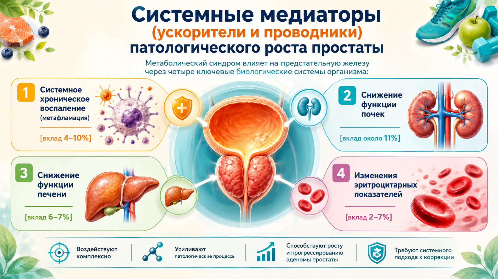
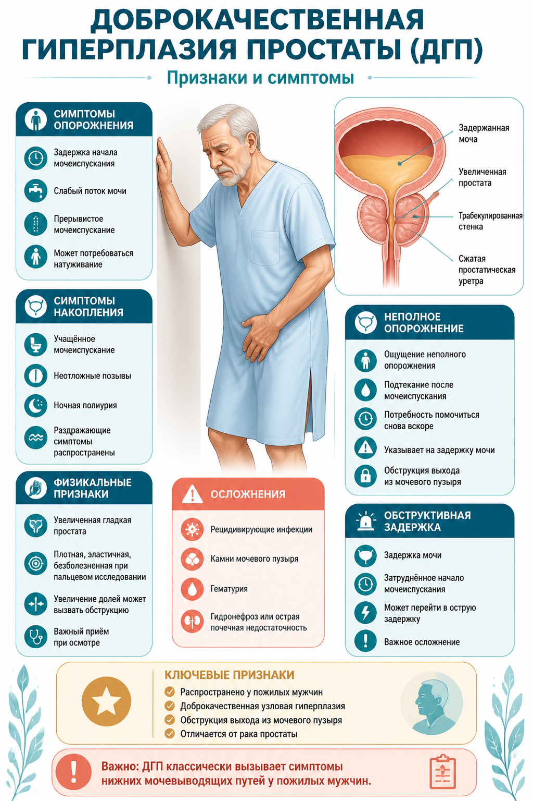
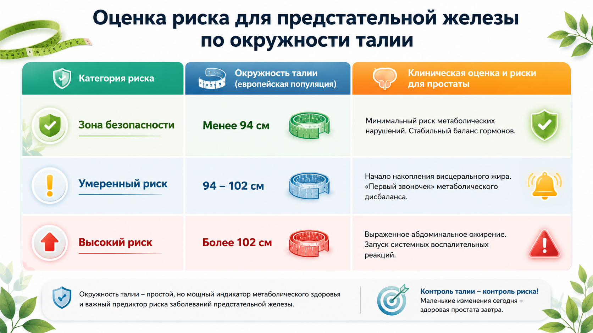
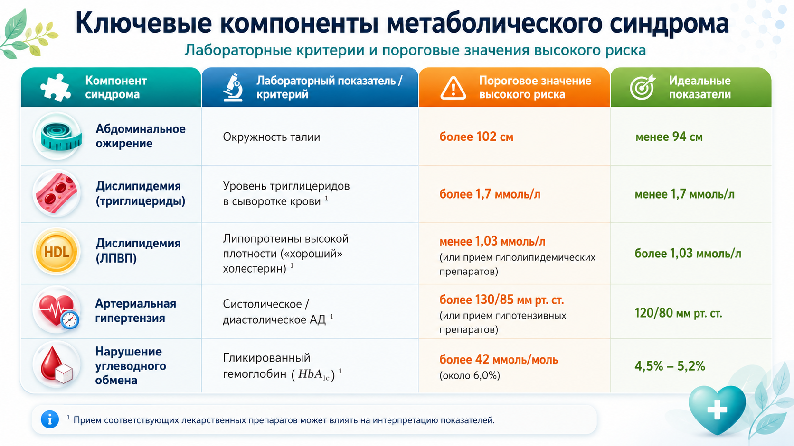
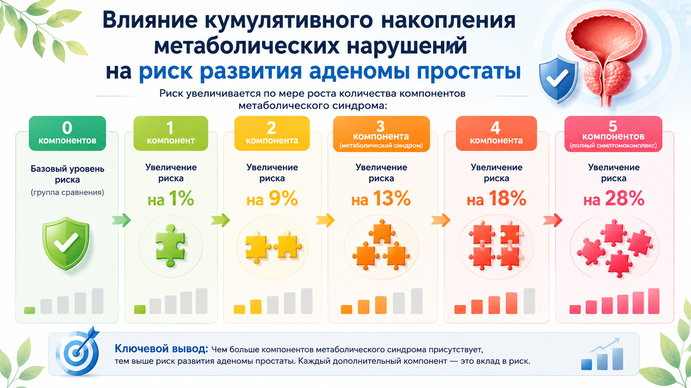
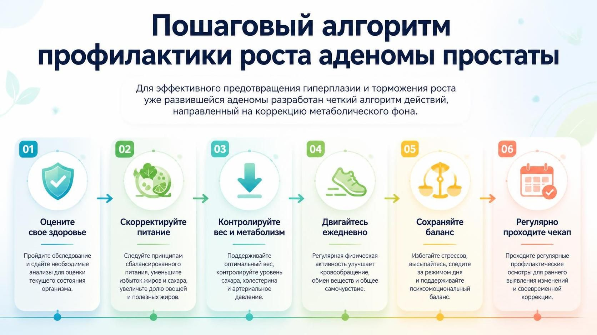
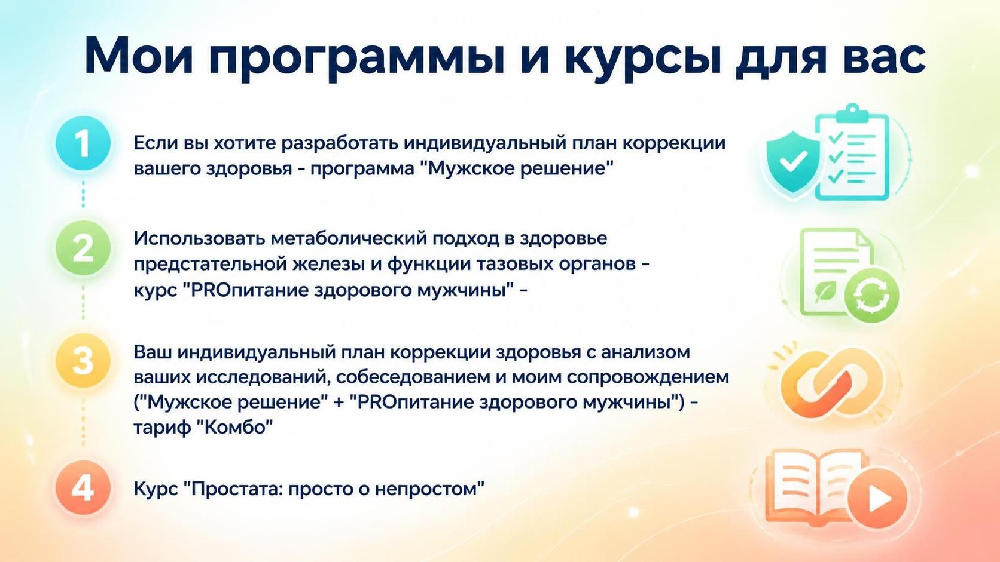
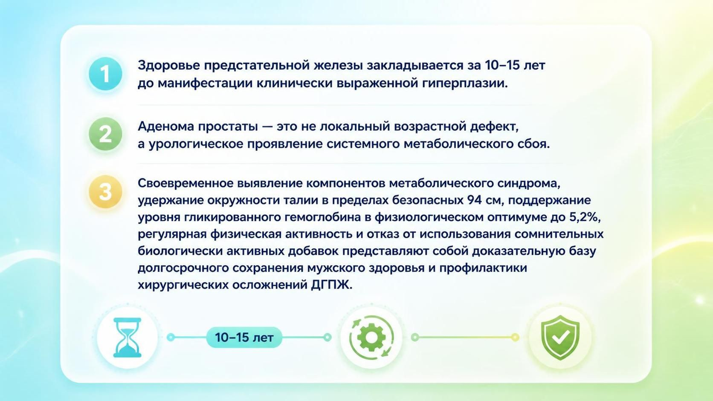

# Клинико-метаболические основы профилактики доброкачественной гиперплазии предстательной железы у мужчин

**Сергей Новиков** — врач-уролог-андролог, кандидат наук, 30 лет в клинике

📺 <a href="https://youtu.be/I5zzmGGS4_4" target="_blank" rel="noopener noreferrer">YouTube</a> · [ВКонтакте](https://vkvideo.ru/video-211671933_456239340) · [RuTube](https://rutube.ru/video/c7f5457e4589d18fa5f2bf91bc5cc727/)

---

## Коротко: что здесь главное

Аденома простаты (ДГПЖ) — не локальный дефект органа, а **урологическое проявление системного метаболического сбоя**. Гены определяют около 60% риска. Оставшиеся 40% — то, что ты можешь изменить.

Главный из модифицируемых факторов — **метаболический синдром**. Это не «плохое самочувствие» и не абстракция: это конкретный набор показателей, каждый из которых измеряется и корректируется.

И у тебя есть **окно возможностей — 10 лет**. Первые 5 лет метаболических нарушений протекают бессимптомно, следующие 5 — риски нарастают, и только потом проявляются тяжёлые урологические симптомы.

---

## Как метаболический синдром бьёт по простате

Метаболический синдром влияет на предстательную железу через четыре ключевые биологические системы:

### 1. Системное хроническое воспаление (метафламмация) — вклад 4–10%

Избыток висцеральной жировой ткани непрерывно секретирует в кровоток провоспалительные цитокины (интерлейкин-6, фактор некроза опухоли-α). Оценка воспаления — по индексам лимфоцитов, нейтрофилов и специализированным шкалам (INFLA, SII). Эти маркеры запускают локальное воспаление в тканях простаты, стимулируя компенсаторное деление её клеток.

### 2. Снижение функции почек — вклад около 11%

Нарушение почечной гемодинамики под влиянием метаболического синдрома ухудшает водно-солевой баланс и способствует задержке метаболитов, повреждающих нижние мочевые пути. Ключевой маркер-посредник — **цистатин C** (объясняет 10,92% всей взаимосвязи между синдромом и аденомой), а также мочевина и мочевая кислота.

### 3. Снижение функции печени — вклад 6–7%

Развитие жирового гепатоза (диффузная неоднородность паренхимы печени на УЗИ) нарушает утилизацию избыточных гормонов (эстрогенов, тестостерона) и инсулина — это дестабилизирует гормональный баланс простаты. Оценка работы печени — по сывороточным уровням АЛТ, АСТ, ГГТ и концентрации альбумина.

### 4. Изменения эритроцитарных показателей — вклад 2–7%

Высокие уровни воспалительных цитокинов нарушают созревание эритроцитов и увеличивают ширину их распределения (RDW). Кровь приобретает склонность к микротромбообразованию, вызывая хроническую гипоксию (кислородное голодание) тканей предстательной железы — мощный триггер для пролиферации клеток.

---

## Симптомы и алгоритм самодиагностики

- **Ослабление и прерывистость струи мочи** — необходимость натуживания, вовлечения мышц брюшного пресса для инициации и поддержания процесса мочеиспускания
- **Ощущение неполного опорожнения мочевого пузыря** — чувство сохранения остаточного объёма жидкости в полости пузыря сразу после завершения акта мочеиспускания
- **Поллакиурия и императивные позывы** — учащённое мочеиспускание в дневное время, сопровождающееся внезапными, труднопреодолимыми позывами к опорожнению
- **Ноктурия** — регулярная необходимость пробуждения для мочеиспускания в ночное время (от 2 до 5 и более раз за ночь). Нарушает физиологические фазы сна, провоцирует хроническое утомление и депрессивные состояния

---

## Антропометрические маркеры: окружность талии

Окружность талии — наиболее сильный антропометрический предиктор ускоренного роста простаты. Накопление висцерального (внутреннего) жира запускает синтез провоспалительных цитокинов, стимулирующих гиперплазию железистой и соединительной ткани.

### Оценка риска для предстательной железы по окружности талии

| Категория риска | Окружность талии (европейская популяция) | Клиническая оценка и риски для простаты |
|---|---|---|
| 🟢 **Зона безопасности** | **Менее 94 см** | Минимальный риск метаболических нарушений. Стабильный баланс гормонов |
| 🟡 **Умеренный риск** | **94–102 см** | Начало накопления висцерального жира. «Первый звоночек» метаболического дисбаланса |
| 🔴 **Высокий риск** | **Более 102 см** | Выраженное абдоминальное ожирение. Запуск системных воспалительных реакций |

> Окружность талии — простой, но мощный индикатор метаболического здоровья и важный предиктор риска заболеваний предстательной железы. **Контроль талии — контроль риска. Маленькие изменения сегодня — здоровая простата завтра.**

### Особый случай — фенотип «skinny fat» («худой толстяк»)

При нормальном индексе массы тела (ИМТ) и отсутствии выраженного подкожного ожирения может наблюдаться скрытый дефицит мышечной массы на фоне избытка висцерального жира, локализованного вокруг внутренних органов.

**Пример:** пациент с нормальным ИМТ (75 кг при росте 175 см), но с окружностью талии 96 см и уровнем триглицеридов 2,0 ммоль/л. Несмотря на видимую стройность, риск развития ДГПЖ — наравне с лицами, страдающими клиническим ожирением.

Потеря мышечной массы (саркопения) ухудшает углеводный обмен: скелетные мышцы — главный потребитель глюкозы. Это поддерживает системное воспаление, ускоряющее рост простаты.

---

## Лабораторные критерии метаболического риска

Диагноз «метаболический синдром» существует при наличии **любых трёх критериев** из пяти приведённых ниже. Метаболический синдром имеет выраженный **кумулятивный (накопительный) эффект** влияния на вероятность развития аденомы простаты.

### Ключевые компоненты метаболического синдрома

| Компонент синдрома | Лабораторный показатель | Пороговое значение высокого риска | Идеальные показатели |
|---|---|---|---|
| Абдоминальное ожирение | Окружность талии | **более 102 см** | менее 94 см |
| Дислипидемия | Триглицериды в сыворотке | **более 1,7 ммоль/л** | менее 1,7 ммоль/л |
| Дислипидемия | Липопротеины высокой плотности (ЛПВП, «хороший» холестерин) | **менее 1,03 ммоль/л** | более 1,03 ммоль/л |
| Артериальная гипертензия | Систолическое / диастолическое АД | **более 130/85 мм рт. ст.** | 120/80 мм рт. ст. |
| Нарушение углеводного обмена | Гликированный гемоглобин (HbA1c) | **более 42 ммоль/моль** | 4,5–5,2% |

*Приём соответствующих лекарственных препаратов может влиять на интерпретацию показателей.*

> Исторический анализ нормативов углеводного обмена демонстрирует постепенное завышение порогов нормы. Показатели, признаваемые сегодня безопасными (например, HbA1c на границе преддиабета в 5,7%), в жёстких стандартах превентивной медицины классифицируются как проявления скрытой перегрузки поджелудочной железы.
>
> **Оптимальный коридор здоровья** для минимизации рисков сосудистых патологий и системного воспаления — **гликированный гемоглобин от 4,5% до 5,2%**.

### Влияние кумулятивного накопления метаболических нарушений

Риск увеличивается по мере роста количества компонентов метаболического синдрома:

| Компонентов | Рост риска |
|---|---|
| 0 | базовый уровень (группа сравнения) |
| 1 | увеличение риска на **1%** |
| 2 | увеличение риска на **9%** |
| 3 | увеличение риска на **13%** |
| 4 | увеличение риска на **18%** |
| 5 (полный метаболический синдром) | увеличение риска на **28%** |

**Ключевой вывод:** чем больше компонентов метаболического синдрома присутствует, тем выше риск развития аденомы простаты. Каждый дополнительный компонент — это вклад в риск.

---

## Пошаговый алгоритм профилактики роста аденомы простаты

Для эффективного предотвращения гиперплазии и торможения роста уже развившейся аденомы разработан чёткий алгоритм действий, направленный на коррекцию метаболического фона.

### Шаг 1. Контроль антропометрических показателей

Регулярное (не реже 1 раза в месяц) измерение окружности живота портновской лентой на уровне пупка в положении стоя после спокойного выдоха.

**При превышении порога в 94 см** — незамедлительный запуск мероприятий по снижению массы висцерального жира.

### Шаг 2. Диетологическая модификация (противовоспалительная модель питания)

**Элиминация простых углеводов.** Исключение или жёсткое ограничение потребления сахара, сладких газированных напитков, промышленных соков, энергетиков, пива, выпечки, белого хлеба и продуктов быстрого приготовления (фастфуда) — для снижения уровня инсулина и гликированного гемоглобина.

**Противовоспалительный рацион.** Обогащение диеты свежими овощами, листовой зеленью и ягодами, богатыми природными антиоксидантами.

**Повышение уровня «хорошего» холестерина (ЛПВП).** Включение в ежедневный рацион качественных источников ненасыщенных жирных кислот: нерафинированное оливковое масло, дикая холодноводная рыба (лосось, скумбрия, сельдь), богатая Омега-3, орехи и авокадо. **Полный отказ от трансжиров.**

### Шаг 3. Физическая активация скелетной мускулатуры

- **Общий объём аэробных нагрузок:** от 150 до 300 минут умеренной физической активности в неделю (быстрая ходьба, плавание, езда на велосипеде)
- **Ежедневный минимум:** не менее 30 минут непрерывной ходьбы в быстром темпе
- **Силовой компонент:** 2–3 раза в неделю упражнения с собственным весом или отягощениями, вовлекающие крупные мышечные группы (ноги, ягодицы). Убирает застойные явления в малом тазу и эффективно утилизирует избыточную глюкозу из системного кровотока

### Шаг 4. Ежегодный комплексный мониторинг (чекап 35+ / 40+)

Мужчинам в возрасте старше 35–40 лет требуется регулярный метаболический и урологический мониторинг. Спектр ежегодных диагностических мероприятий:

1. **Гликированный гемоглобин (HbA1c)** — оценка реальной картины углеводного обмена за последние 3 месяца. Целевой параметр: **строго ниже 5,2%**
2. **Липидный профиль (липидограмма)** — контроль уровней общего холестерина, ЛПВП (цель: **> 1,03 ммоль/л**) и триглицеридов (цель: **< 1,7 ммоль/л**)
3. **Почечный комплекс** — креатинин, мочевина, мочевая кислота и сывороточный **цистатин C** для раннего выявления скрытой почечной дисфункции
4. **Печёночный профиль** — активность ферментов АЛТ, АСТ, ГГТ и концентрация альбумина для оценки детоксикационной функции печени и исключения жировой дистрофии
5. **Урологический онкомаркер** — уровень общего простатспецифического антигена (**ПСА**) для исключения злокачественной трансформации тканей простаты
6. **Ультразвуковая диагностика** — УЗИ почек и мочевого пузыря, а также **ТРУЗИ предстательной железы** (наиболее точно верифицирует объём органа в см³, его структуру и объём остаточной мочи)

### Шаг 5. Медикаментозный контроль и безопасность терапии

**Строгая приверженность терапии.** При наличии назначений по поводу компонентов метаболического синдрома (гипотензивные средства, статины, метформин) приём препаратов должен осуществляться **непрерывно** под контролем лечащего врача. Стабилизация метаболического фона напрямую снижает риски прогрессирования аденомы.

**Категорический отказ от сомнительных БАД.** Запрещено употребление несертифицированных растительных комплексов, рекламируемых как средства для мгновенного восстановления мужского здоровья. В неофициальных препаратах часто выявляются недекларированные синтетические примеси (например, дешёвые аналоги силденафила или несертифицированные формы тестостерона), способные спровоцировать сосудистый спазм, острую задержку мочеиспускания и кардиоваскулярные катастрофы.

---

## Мои программы и курсы для вас

- **Программа «Мужское решение»** — индивидуальный план коррекции здоровья → [urotesting.ru](https://urotesting.ru/)
- **Курс «PROпитание здорового мужчины»** — метаболический подход к здоровью предстательной железы и функции тазовых органов → [nut.skillspace.ru](https://nut.skillspace.ru/course/55501/about)
- **Тариф «Комбо»** — индивидуальный план коррекции здоровья с анализом ваших исследований, собеседованием и сопровождением → [urocombo.tilda.ws/comb](https://urocombo.tilda.ws/comb)
- **Курс «Простата: просто о непростом»** → [urocombo.tilda.ws/prosto](https://urocombo.tilda.ws/prosto)

---

## Заключение

1. **Здоровье предстательной железы закладывается за 10–15 лет** до манифестации клинически выраженной гиперплазии.
2. **Аденома простаты — это не локальный возрастной дефект**, а урологическое проявление системного метаболического сбоя.
3. **Доказательная база долгосрочного сохранения мужского здоровья:**
   - своевременное выявление компонентов метаболического синдрома
   - удержание окружности талии **в пределах безопасных 94 см**
   - поддержание уровня гликированного гемоглобина **в физиологическом оптимуме до 5,2%**
   - регулярная физическая активность
   - отказ от использования сомнительных биологически активных добавок

Это база профилактики хирургических осложнений ДГПЖ.

---

## Источники

1. [Metabolic Syndrome and Benign Prostatic Hyperplasia / What Component of Metabolic Syndrome Is Related to Benign Prostatic Hyperplasia? — ResearchGate](https://www.researchgate.net/publication/372835969)
2. [Association between metabolic syndrome and risk of benign prostatic hyperplasia: a prospective cohort study of 163 975 participants — PubMed](https://pubmed.ncbi.nlm.nih.gov/41039869/)
3. [Prevalence and association of metabolic syndrome components with benign prostate hyperplasia — PMC](https://pmc.ncbi.nlm.nih.gov/articles/PMC12862902/)
4. [The Association Between Metabolic Syndrome and Benign Prostatic Hyperplasia: A Systematic Review and Meta-Analysis — PubMed](https://pubmed.ncbi.nlm.nih.gov/41928554/)

---

*По материалам видео «Аденома простаты — профилактика и метаболический синдром. Уролог в поликлинике об этом не расскажет!»*
